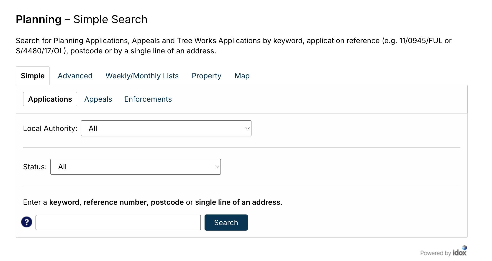
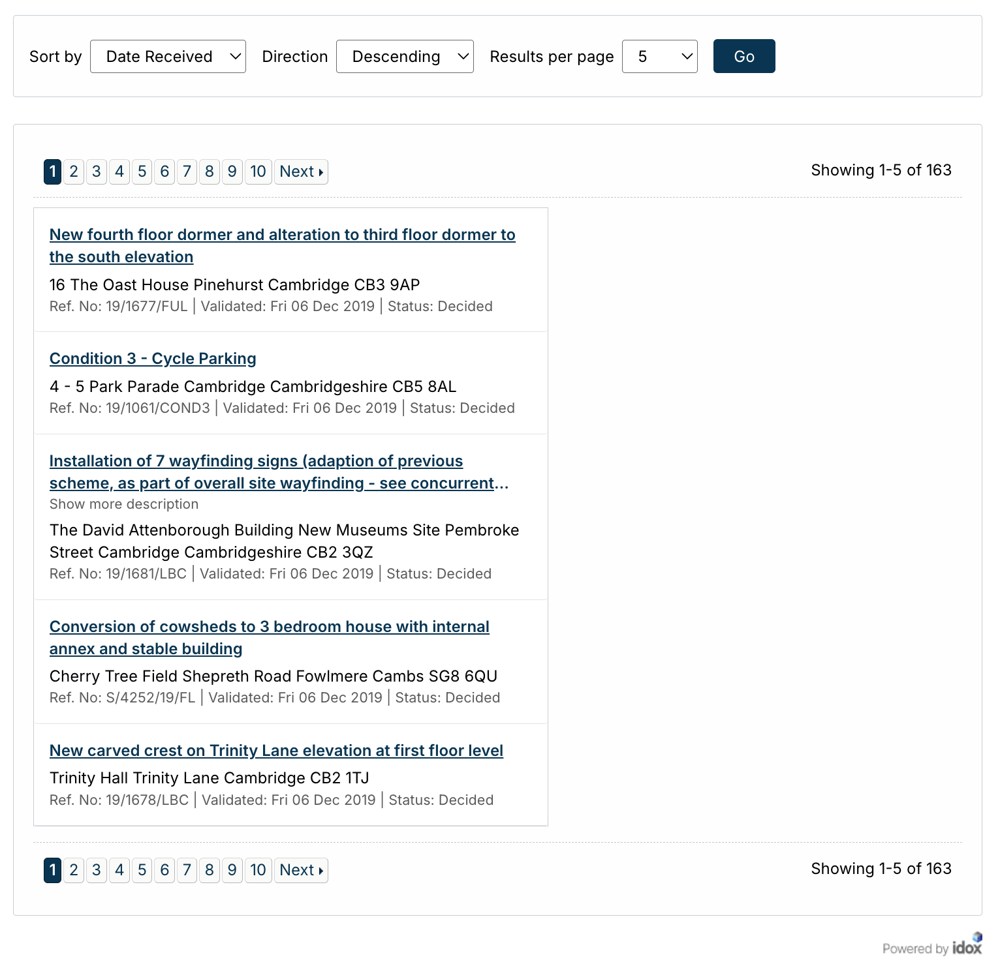
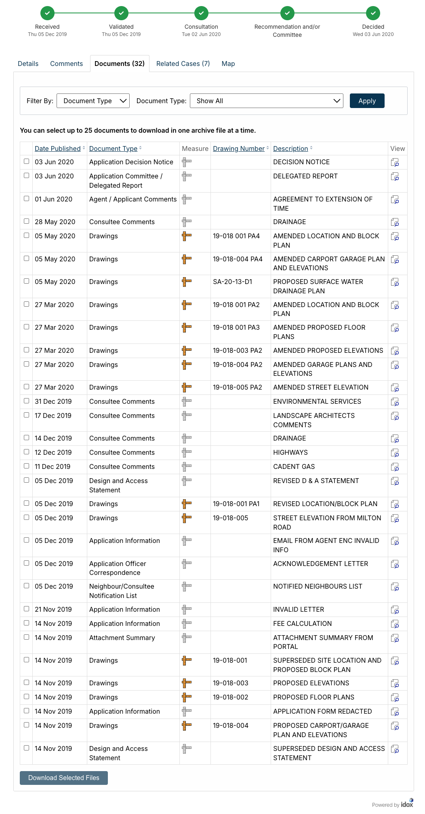

# Idox

## A Visual Walkthrough

Idox make the planning portal for software uses by most local planning authorities in the UK.

This is what the main search form of an Idox planning portal looks like:

### The Main Form

#### The Advanced Search Form

If we click over to the "Advanced" tab, this is what we see:

The URL of the advanced search tab is, in the case of Cambridge:

`https://applications.greatercambridgeplanning.org/online-applications/search.do?action=advanced`

This is the scraper's start URL.

### The Advanced Search Form's Results Page

If we leave the applications button selected, and enter a start and end value for the "Date Validated" field, we get a list of results that looks something like this:

### An Application

If we click on one of those applications, (not on pictured in this case), we get taken to the application's "Details > Summary" tab:

#### The Details > Summary Tab

##### URL

`https://applications.greatercambridgeplanning.org/online-applications/applicationDetails.do?activeTab=summary&keyVal=Q0YSEDDXIK800`

##### Information

- Reference
- Application Received
- Application Validated
- Address
- Proposal
- Status
- Decision
- Decision Issued Date
- Appeal Status
- Appeal Decision

##### Image

#### The Details > Further Information Tab

##### URL

`https://applications.greatercambridgeplanning.org/online-applications/applicationDetails.do?activeTab=details&keyVal=Q0YSEDDXIK800`

##### Information

- Application Type
- Decision
- Expected Decision Level
- Case Officer
- Parish
- Ward
- District Reference
- Applicant Name
- Agent Name
- Agent Company Name
- Agent Address
- Environmental Assessment

##### Image

#### The Documents Tab

##### URL

`https://applications.greatercambridgeplanning.org/online-applications/applicationDetails.do?activeTab=documents&keyVal=Q0YSEDDXIK800`

##### Information

For each document, we get:

- Date Published
- Document Type
- Measure
- Drawing Number
- Description

##### Image

#### The Map Tab

##### URL

`https://applications.greatercambridgeplanning.org/online-applications/applicationDetails.do?activeTab=map&keyVal=Q0YSEDDXIK800`

##### Image

## The Scraper
